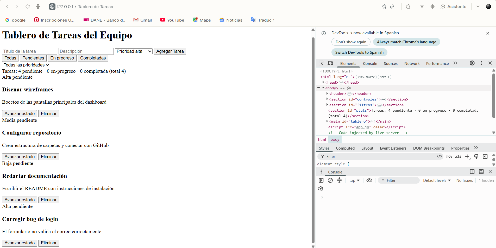
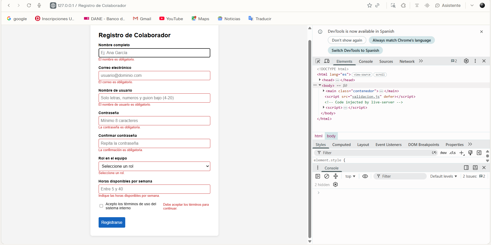
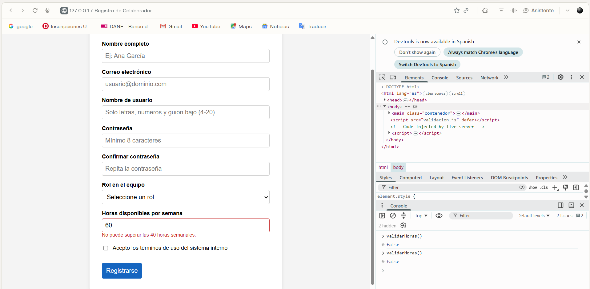

# Post-contenido — Unidad 4: JavaScript Básico

## Descripción
Repositorio del laboratorio de la Unidad 4 de Programación Web —
Séptimo Semestre. Contiene dos partes: tablero de tareas del equipo
con manipulación del DOM y eventos (parte-1-tablero-tareas/) y
formulario de registro de colaborador con validación manual y
Constraint Validation API (parte-2-formulario-colaborador/).

## Parte 1 — Tablero de tareas del equipo
Tablero de tareas en JavaScript puro que implementa creación,
avance de estado y eliminación (con un único listener delegado que
distingue acciones por data-action), filtrado combinado por estado
y prioridad, un switch para la apariencia por prioridad, y
estadísticas calculadas con reduce() y for...of. Ver
parte-1-tablero-tareas/.

## Parte 2 — Formulario de registro de colaborador
Formulario de registro con validación completa del lado del
cliente: campo de usuario validado con pattern, campo condicional
"equipo a cargo" que solo aplica al rol Líder, campo numérico de
horas validado con rangeUnderflow/rangeOverflow, checkbox de
términos validado por .checked, control del evento submit y un
indicador de fortaleza de contraseña. Ver
parte-2-formulario-colaborador/.

## Decisiones de diseño

### Parte 1 — Generador de ID
Se eligió la **Estrategia A (closure / patrón módulo)**. La función
`crearGeneradorId()` encapsula el contador en una variable privada
que solo es accesible a través de la función `generarId()` que
devuelve. Esto evita que cualquier otra parte del código pueda leer
o reasignar el contador por accidente, priorizando la encapsulación
sobre la simplicidad de una variable expuesta a nivel de módulo.

### Parte 1 — Actualización del DOM al avanzar estado
Se eligió la **Estrategia A (actualización dirigida)**. Al avanzar
el estado de una tarea, se localiza su nodo existente con
`querySelector` y se actualizan solo su clase de estado y el texto
de su badge, sin reconstruir el resto del tablero. Es más eficiente
porque no se regenera nada que no cambió, aunque requiere mantener
el código de actualización sincronizado manualmente con la
estructura HTML de `crearElementoTarea`.

### Parte 2 — Validación de contraseña
Se eligió la **Estrategia B (validaciones independientes
encadenadas)**. Cada regla (mayúscula, número, carácter especial)
se comprueba por separado con su propio mensaje específico. Aunque
requiere más código que una única regex compuesta, informa
exactamente qué requisito falta, mejorando la experiencia del
usuario en un formulario de registro real.

### Parte 2 — Campo condicional "equipo a cargo"
Se eligió la **Estrategia A (alternar el atributo required
nativo)**. En el listener de "change" de #rol, se asigna
`document.querySelector("#equipo").required = esLider`, de forma
que `checkValidity()` y `campo.validity.valueMissing` reflejan
automáticamente si el campo aplica o no, aprovechando la Constraint
Validation API tal como está diseñada.

## Cómo visualizar el proyecto
1. Clonar el repositorio: `git clone https://github.com/richardrabt21/boada-post1-u4.git`
2. Abrir la carpeta en Visual Studio Code
3. Clic derecho en index.html (de cada parte) → "Open with Live Server"

## Capturas de pantalla

